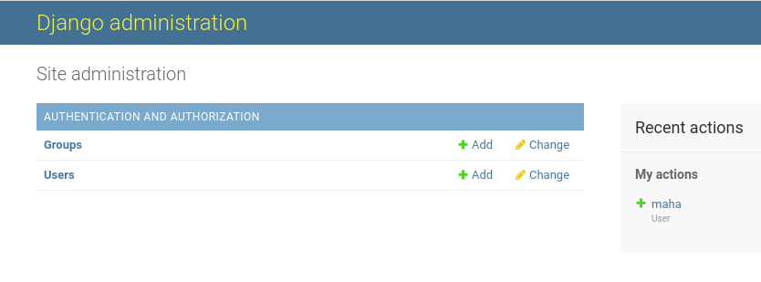
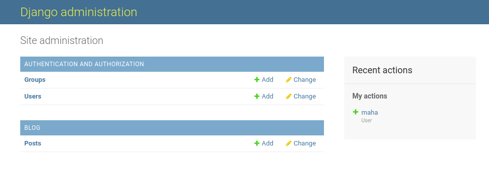

# Django Getting Started Notes:

## Useful Resources:
 - [Blog-Website-Tutorial](https://www.youtube.com/playlist?list=PL-osiE80TeTtoQCKZ03TU5fNfx2UY6U4p)
 

## Project Creation Steps:
1. Create virtual environment:
    ```sh
    virtualenv venv
    ```
    
2. Activate virtual environment: 
    ```sh
        source venv/bin/activate
    ```
3. Install Django:
    ```sh
        pip install django
    ```
4. Start new django-project:
    ```sh
        dgango-admin startproject BlogHub
    ```
    
5. Change directory to project-directory:
    ```sh
        cd BlogHub
    ```
6. Run development Server: 
    ```sh
        python manage.py runserver
    ```
    
## Create New Application:

1. Create new application:
    ```sh
        python manage.py blog
    ```
2. Add the new app to **settings.py**:
    ```py
        INSTALLED_APPS = [
        'blog.apps.BlogConfig',
        'django.contrib.admin',
        'django.contrib.auth',
        'django.contrib.contenttypes',
        'django.contrib.sessions',
        'django.contrib.messages',
        'django.contrib.staticfiles',
     ]
    ``` 
    
## View:
- In **blog/views.py**:
    ```py
       from django.shortcuts import render
       from django.http import HttpResponse

        # Create your views here.
        def home(request):
            return render(request, 'blog/home.html')
            
        def about(request):
           return HttpResponse('<h1>BlogHub About</h1>')
    ```
    
- In **blog/urls**:
    ```py
        from django.urls import path
        from . import views
        
        
        urlpatterns = [
            path('', views.home, name="blog-home"),
            path('about/', views.about, name="blog-about"),
        ]

    ``

- In **BlogHub/urls**:
    ```py
        from django.contrib import admin
        from django.urls import path, include
        
        urlpatterns = [
            path('admin/', admin.site.urls),
            path('', include('blog.urls')),
        ]
    ```
- To use models in views:
    ```sh
        from .models import Post
        
        def home(request):
            context = {
                'posts': Post.objects.all()
            }
            return render(request, 'blog/home.html', context)
    ```

## Templates:
- Under **blog/** create new **templates** directory.
- Under **blog/templates/** create new app directory:
    ```sh
        blog --> templates --> blog -> files.html
    ```
    
## Models:
- Make sure to make at least one migration to be able to use admin-page:
1. Create **Class** for each **Table** in **app/models.py**:
    ```sh
        from django.db import models
        from django.utils import timezone
        from django.contrib.auth.models import User
        
        
        # Create your models here.
        class Post(models.Model):
            title = models.CharField(max_length=100)
            content = models.TextField()
            date_posted = models.DateTimeField(default=timezone.now)
            author = models.ForeignKey(User, on_delete=models.CASCADE)
    ```
2. Prepare migrations:
    ```sh
        python manage.py makemigrations
    ```
3. Apply migrations:
    ```sh
        python manage.py migrate
    ```

- Django has its own **ORM** (Object Relational Mapper), it allows to access databases.

- If you want to see exact sql query run to create a model:
    ```sh
        python manage.py sqlmigrate blog 0001
    ```
    
    ```sh
        BEGIN;
        --
        -- Create model Post
        --
        CREATE TABLE "blog_post" ("id" integer NOT NULL PRIMARY KEY AUTOINCREMENT, "title" varchar(100) NOT NULL, "content" text NOT NULL, "date_posted" datetime NOT NULL, "author_id" integer NOT NULL REFERENCES "auth_user" ("id") DEFERRABLE INITIALLY DEFERRED);
        CREATE INDEX "blog_post_author_id_dd7a8485" ON "blog_post" ("author_id");
        COMMIT;
    ```
    
## Admin-Page:
- Database migration must be done before this command:
    ```sh
        python manage.p createsueruser
    ```

- To add model to admin-page:
    
    
    - Register your model in **blog/admin.py**:
        ```sh
            from django.contrib import admin
            from .models import Post
            admin.site.register(Post)
        ```
        
    
    
## Shell:
- To open python shell for debugging, testing, or investigation:
    - This opens our django-project in an ordinary python shell:
        ```sh
            python manage.py shell
        ```
    - To open the project with iPython shell (it supports colors and auto-complete):
        ```sh
            pip install ipython
        ```
        
        ```sh
            python manage.py shell
        ```
        

- Investigating our models:
    ```sh

        In [1]: from blog.models import Post                                           
        In [2]: from django.contrib.auth.models import User                             
        
        In [3]: User.objects.all()                                                     
        Out[3]: <QuerySet [<User: admin>, <User: maha>]>
        
        
        In [4]: User.objects.first()                                                   
        Out[4]: <User: admin>
        
        
        In [5]: User.objects.filter(username='admin')                               
        Out[5]: <QuerySet [<User: admin>]>
        
        
        In [6]: User.objects.filter(username='admin').first()                       
        Out[6]: <User: admin>
        
        
        In [7]: user = User.objects.filter(username='maha').first()
        In [8]: user                                                                   
        Out[8]: <User: maha>
        
        
        In [9]: user.id                                                                
        Out[9]: 2


        In [10]: user.pk                                                               
        Out[10]: 2
        
        
        In [11]: user = User.objects.get(id=1)                                         
        In [12]: user                                                                  
        Out[12]: <User: admin>
        
    ```
- Create new object via python shell:
    ```sh
        In [16]: post_1 = Post(title='Blog 1', content='First Post Content!', author=use
            ...: r)                                                                     
        
        In [17]: Post.objects.all()                                                     
        Out[17]: <QuerySet []>
        
        In [18]: post_1.save()                                                         
        
        In [19]: Post.objects.all()                                                     
        Out[19]: <QuerySet [<Post: Post object (1)>]>

    ```
- To get more descriptive output than this:
    ```sh
        In [19]: Post.objects.all()                                                    
        Out[19]: <QuerySet [<Post: Post object (1)>]>
    ```
    
    - In **models.py**:
        ```sh
            class Post(models.Model):
                ... 
                def __str__(self):
                    return self.title

        ```
    - Restart the python shell.
    - The output will be:
        ```sh
            In [3]: Post.objects.all()                     
            Out[3]: <QuerySet [<Post: Blog 1>]>
        ```
- To get all posts created by a user:
    ```sh
        In [19]: user.post_set.all()                                                   
        Out[19]: <QuerySet [<Post: Blog 2>]>
    ```
- Creae new post by this user:
    ```sh
        In [20]: user.post_set.create(title='Blog 3', content='Third Post Content!')
        Out[20]: <Post: Blog 3>
        
        In [21]: Post.objects.all()                                                    
        Out[21]: <QuerySet [<Post: Blog 1>, <Post: Blog 2>, <Post: Blog 3>]>

    ```
## Seach about these topics:
- Magic functions (ex: def \__str__(self):)
- Vertical column filter (ex: post.date_posted|date:"F d, Y" [Django Date Filter](https://docs.djangoproject.com/en/2.0/ref/templates/builtins/#date)
    
    

    
    

